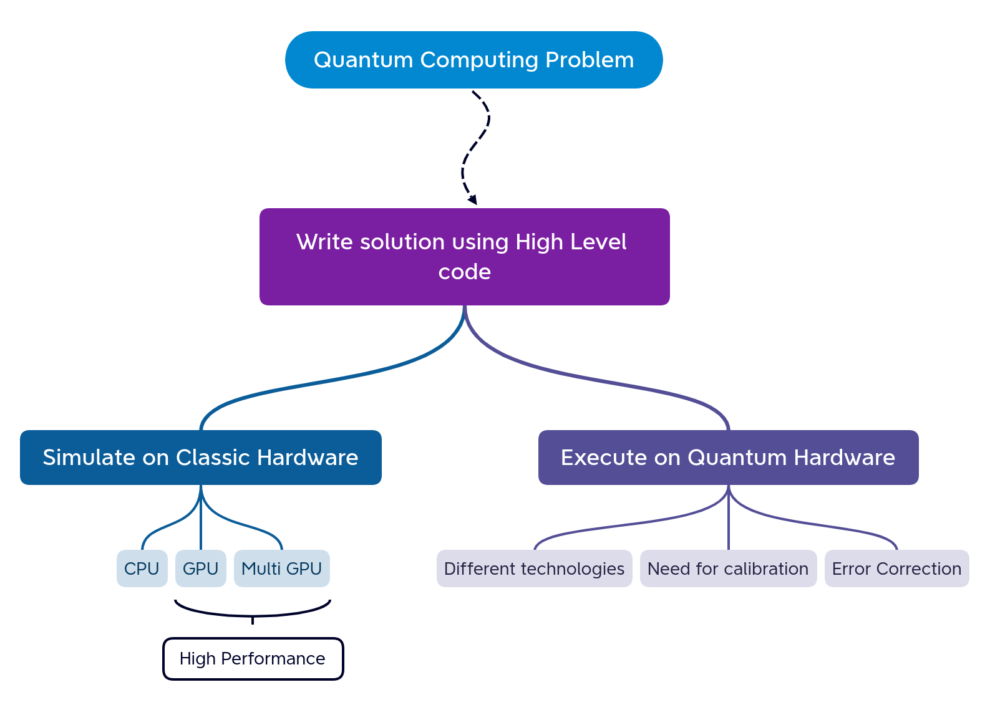
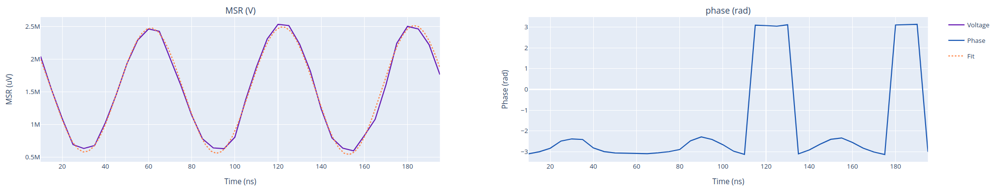
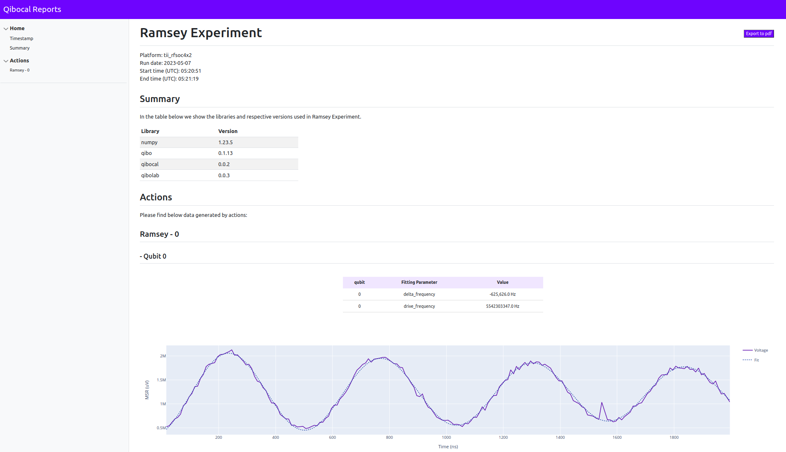

# Towards an open source quantum operating system

Edoardo Pedicillo on behalf of the [Qiboteam](https://github.com/qiboteam)

ACAT, 11th March 2024

<br>
<br>
<div class="row">
  <div class="column3">
    
  </div>
  <div class="column3">
    
  </div>
  <div class="column3">
    
  </div>
  <div class="column3">
    
  </div>

</div>

---

# Challenging quantum computing applications

##

<p align="center">

</p>
---

# Introduction to Quantum Computers

##

- In a quantum computer bits are replaced by **qubits**
- The state of the qubit is a superposition of two quantum states
$$
\ket\psi = \alpha \ket 0 + \beta \ket 1 
$$

  - We can act on qubits with unitary operators represented as **gates** (i.e., Hadamard gate)

$$
H = \frac{1}{\sqrt{2}}\begin{bmatrix}
1 & 1 \\
1 & -1
\end{bmatrix},

\qquad 

CX = \begin{bmatrix}
1 & 0 & 0 & 0 \\
0 & 1 & 0 & 0 \\
0 & 0 & 0 & 1 \\
0 & 0 & 1 & 0 
\end{bmatrix}
$$

  - When we apply a series of either unitary or measurement gates to a styem of qubits, initialized to a known state we obtain a quantum **circuit** ,i.e., Grover, variational quantum circuits.

<p align="center">

</p>


---
transition: slide-left

layout: center
class: text-center
---


# How can we start using Quantum Computing?

##

<p align="center">

</p>


---
transition: slide-up
layout: center
class: text-center
---

# Qibo ecosystem

Open-source full stack API for quantum simulation, hardware control and calibration
<div class=bottomleft>
<a href="https://quantum-journal.org/papers/q-2024-02-12-1247/pdf/">Quantum Journal</a>
</div>
<div class=bottomright>
<a href="https://github.com/qiboteam/qibolab">qiboteam/qibo</a>
</div>


---
transition: slide-left

---

<p align="center">

</p>

---
transition: slide-left

---

<p align="center">

</p>

---
transition: slide-left

---

<p align="center">

</p>


---
transition: slide-up
layout: center
class: text-center
---

# Qibolab

open-source software library for quantum hardware control 
<div class=bottomleft>
<a href="https://quantum-journal.org/papers/q-2024-02-12-1247/pdf/">Quantum Journal</a>
</div>
<div class=bottomright>
<a href="https://github.com/qiboteam/qibolab">qiboteam/qibolab</a>
</div>


---

# Quantum lab

##

<p align="center">

</p>


---

# How does a quantum lab work?

##

<div style="display:block; width:100%;">
  <div style="width:30%; float: left; display: inline-block;">
  <ul>
    <li><p>The host computer
running Qibolab communicates with the different electronics
used to control a QPU.</p></li>
    <li><p>The readout and feedback channels measure the qubits,</p></li>
    <li><p>the drive channel applies gates,</p></li>
    <li><p>the flux channels for tuning their frequency.</p></li>
    </ul></div>
  <div style="width:70%; float: left; display: inline-block;">
  <p align="center">

</p>
</div>
</div>

---

# Software abstraction

##

<div style="display:block; width:100%;">
  <div style="width:40%; float: left; display: inline-block;">
  <br>
  <br>
  <ul>
  Qibolab provides two main interface objects:  
  <li><p>the
<code>Pulse</code> object for defining arbitrary pulses to be played
on qubits, </p></li>
    <li><p>the <code>Platform</code> which is used to execute
these pulses on a specific QPU and set of instruments. </p></li>
    </ul>
    </div>
  <div style="width:60%; float: left; display: inline-block;">
  <p align="center">

</p>
</div>
</div>
---

# Platform object

<div style="display:block; width:100%;">
  <div style="width:50%; float: left; display: inline-block;">
  <ul>
  <br>
  Platform is comprised of different objects:
    
  <p v-click="1">
    <li><p><code>Qubit</code> contains information about
qubit physical parameters,</p></li>
   </p> 
  <p v-click="2">
    <li><p><code>QubitPair</code> stores the
information about the corresponding two-qubit native gates,</p></li>
</p>
  <p v-click="3">
    <li><p>The <code>Instrument</code>
class collects the methods to interface <code>Qibolab</code> to the instruments'
libraries,</p></li>
</p>
<p v-click="4">
    <li><p><code>Channel</code> represents a connection from
qubits to instruments.</p></li>
</p>
<p v-click="5">

<li><p>the <code>Port</code> is the interface to control instrument parameters.</p></li>
</p>
    </ul>
    </div>
  <div style="width:50%; float: left; display: inline-block;">
  <p align="center">
  <br>
  <br>
  <br>

</p>
</div>
</div>
---
transition: slide-up
layout: center
class: text-center
---


# Qibocal
A reporting tool for calibration using Qibo

<div class=bottomleft>
<a href="https://arxiv.org/abs/2303.10397">arxiv:2303.10397</a>
</div>
<div class=bottomright>
<a href="https://github.com/qiboteam/qibocal">qiboteam/qibocal</a>
</div>
---

# Motivation
##

Let's suppose the following:
<ol>
<li><p>We have a QPU (self-hosted).</p></li>
<li><p>We have control over what we send to the QPU.</p></li>
<li><p>We know how to convert quantum circuits to pulses. </p></li>
</ol>

Can I **trust** my results? **NO!**


**Characterization** and **calibration** are an essential step to properly operate emerging quantum devices.
<p align="center">

</p>

---
backgroundSize: contain
---

# How to calibrate superconducting devices?

##


<div h="full" flex="~ row" gap="lg">
<div flex="~ col">
<br>
<br>
<p>
In superconducting qubits gates are implemented
through microwave pulses.

Several protocols need to be executed to extract
specific parameters.

After an initial calibration more advanced experiments
can be performed in order to:

- improve readout
- run benchmarking protocols
- reach optimal control
</p>
</div>
<div flex="~ col">
<center>
<br>

</center>
</div>
</div>


---

# From gates to pulses
##

Given a general single qubit gate it is possible to decompose it in **RX** and **RZ** gates
<p align="center">

</p>
From the level of pulses:

-  An **RX** is a Gaussian pulse calibrated by Rabi experiment
-  An **RZ** is a change in the virtual phase of the pulses.
-  An **MZ** is a rectangular pulse calibrated  by readout optimization routines

<p align="center">

<em> How an RX and measurement gate is performed at the pulses level on a qubit.</em>
</p>


---

# Qubits Characterization
##
<p align="center">

</p>

---

# How to perform an experiment 

##

<p align="center">

</p>


---

# Report

##

<p align="center">

</p>


---

# Towards automation

<div style="display:block; width:100%;">
  <div style="width:30%; float: left; display: inline-block;">
  <br>
  <br>
  <ul>
    <li><p>Specify a direct acyclic graph with various experiments</p></li>
    <li><p>Parameters computed are fed from one routine to the next</p></li>
    <li><p>Full quantum chip recalibration</p></li>
    </ul></div>
  <div style="width:70%; float: left; display: inline-block;">
  <p align="center">

</p>
</div>
</div>


---

# Qibolab + Qibocal

##

<p align="center">

</p>

$$T_{real} = T_{qibo}+T_{instrument}+T_{ideal}$$ 


---
clicks: 3
---

# Qibo+Qibolab+Qibocal

<div h="full" flex="~ row" gap="lg" p="sm b-20">
<div class="stupid" flex="~ col">
<p v-click="1">
<h>
1. Circuit definition
</h>
<br>
<br>
```py
from qibo import Circuit, gates

c = Circuit(2)
c.add(gates.H(0))
c.add(gates.CNOT(0,1))
c.add(gates.M(0,1))
shots = c(nshots=1000)
```
<br>


</p>
</div>
<div class="stupid" flex="~ col justify-center" v="full">
<p v-click="2">
<h>
2. Circuit compilation
</h>
<p>
Translate the circuit into 
a sequence of pulses
considering the chip topology.
</p>
<p align="center">

</p>
</p>
</div>
<div class="stupid" flex="~ col justify-center" v="full">
<p v-click="3">
<h>
3. Hardware execution
</h>
<p align="center">

</p>
</p>

</div>
</div>

---
layout: center
---

# Summary and Outlooks

##

- Introduction of Qibo as full stack API
- Qibolab for quantum control
- Qibocal to calibrate quantum devices

<p v-click="1">
<br>

- Qibotn
- Two qubit gates calibration
- Automation of the calibration workflow
</p>
---
layout: center
class: text-center
---

# Thanks for listening!


